# Plotter Studio manual

How to use Plotter Studio, from the Inkscape menu to a finished plot. For the code, see [README.md](README.md).

Plotter Studio is an alpha. Only the simulator has been run so far. On a real plotter, start with small moves and keep a hand near the Stop button.

## Install

Copy the five files from `extensions/` into Inkscape's extension folder (on macOS `~/Library/Application Support/org.inkscape.Inkscape/config/inkscape/extensions/`):

```
idraw_core.py  idraw_server.py  idraw_web.html  idraw_interactive.py  idraw_interactive.inx
```

The original "iDraw 2.0 Control" by UUNA TEK has to be in the same folder, because Plotter Studio reads SVGs with its code from `idraw_deps/`. Restart Inkscape.

## Start

Open a document in Inkscape and choose Extensions > Plotter > Plotter Studio. The dialog has two options:

- Simulation: no device needed. The simulator answers like a plotter and runs four times faster than real time.
- Allow other devices on the network: the page can also be opened from an iPad or another computer in the same network. The address is printed by the server. Anyone on the network can then move the plotter; there is no password.

The extension returns at once and opens the page in the browser. Inkscape stays usable and the document is not changed. To plot a changed drawing, close the browser tab and run the extension again.

Without Inkscape, from a terminal in `extensions/`:

```
python3 idraw_server.py drawing.svg --sim
```

Further options: `--port N`, `--lan` (other devices), `--no-browser`.

## The page

The board on the left shows the sheet, the drawing and the carriage. Below it is the log with the console. On the right are the five steps, 1 Connect to 5 Plot. The tabs can be used in any order; a tick marks the steps that are done.

The app bar at the top shows the status (ready, moving, plotting, paused), the position, the pen state, the unit switch (mm, cm, in), Reset and a red Stop.


## The five steps


### Connect

Choose the port and click Connect. "Simulation" is always in the list. Choose your plotter in Model; the choice is remembered. Models other than the iDraw A1 are marked "(untested)": their commands were written from the vendors' code and have not run on a device yet.

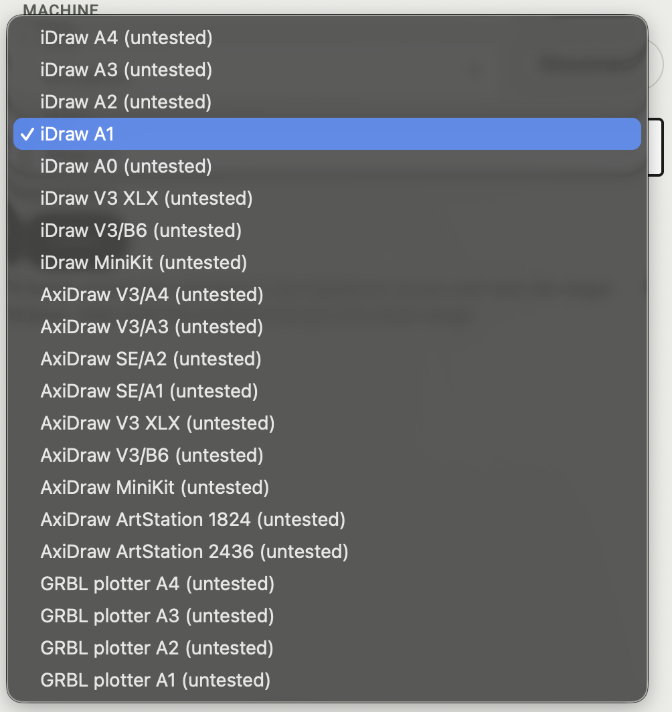

Home moves the carriage to the reference corner and sets the origin there. After homing, the software knows the travel range of the machine and draws it on the board.


### Paper

Tape the sheet to the table. Choose the format and orientation, or "Custom" and type width and height, then Apply.

Then tell the software where the top-left corner of the sheet is. There are three ways:

- Against the stop corner: the sheet lies in the home corner, the origin is home.
- Jog the pen to the paper corner: move the carriage with the arrows until the pen is over the corner, then Set origin here.
- Push the carriage by hand: Release motors, push the pen tip onto the corner, Set origin here. The travel range is unknown afterwards and the machine frame is hidden.

Trace frame moves around the sheet with the pen up, so you can check the position.


### Pen

Insert the pen. Down lowers it, Up raises it; the heights are in mm and can be changed in 0.5 mm steps with the buttons next to them, or with Shift+Up and Shift+Down on the keyboard. Lower the pen until it sits cleanly on the paper, raise it and check that it clears the sheet.

Cycle lowers the pen, waits half a second and raises it. Test stroke draws a 30 mm line to the right of the current position and returns.

Heights, feed rates and line width form a profile. Type a name under "Save as" and click Save to keep it; choose it later in Profile.


### Speed

Feed rates for drawing and travel, in mm/min. Line width is the width you measured on paper; it is printed in the title block. Save profile stores the values in the current profile.

Test drawing replaces your document with a calibration sheet from the `tests/` folder; [Test drawings](#test-drawings) below shows each one and what it is for. The first entry, under Document, brings your document back. Plot it from step 5. Your own SVGs dropped into `tests/` appear in the list too. While a drawing loads, or hidden lines are removed, a dialog with a spinner shows what is going on and how many seconds it has taken so far.

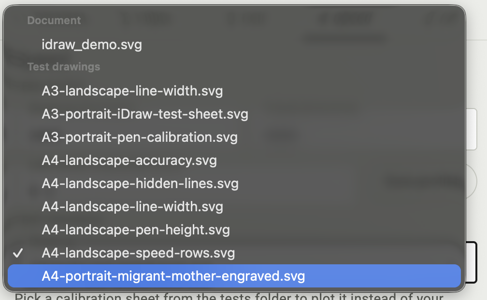

### Plot

Placement puts the drawing on the sheet:

- 1:1: the page's top-left corner on the origin, no scaling.
- Centered: 1:1, page centered on the sheet.
- Fit to paper: scaled to the sheet with a 10 mm margin.

Position, scale, rotation (click to unfold) places the drawing freely. X and Y are the top-left corner of the drawing on the sheet, Scale is in percent and keeps the drawing's centre. The six align buttons put the drawing against the left, centre or right and the top, middle or bottom of the sheet; with Margin selected, they keep the distance set under Margin from the edges. ↺ and ↻ turn the drawing about its centre by the step chosen next to them, 90° (for example a portrait drawing onto a sheet taped in landscape) or 15°. The Angle field takes a number directly and rounds it to 15°. The presets fit the whole turned page, so Fit to paper makes a drawing at 45° smaller. The size of the drawing is shown next to the angle. While this part is unfolded, you can also drag the drawing on the board with the mouse; folded, a drag on the board moves the view as before. The three buttons above start again from 1:1, Centered or Fit to paper and keep the rotation.

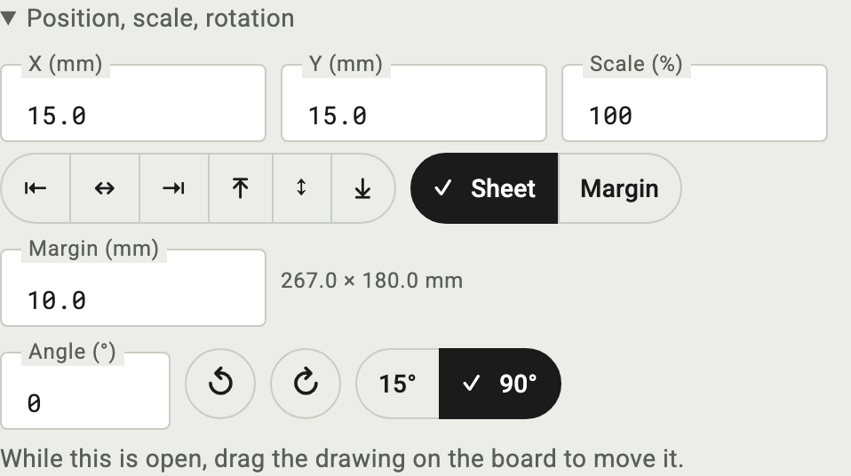

Layers lists the layers of the document with their number of paths. Untick a layer to skip it. Tick "Pause before" to stop before a layer, for example to change the pen; a dialog asks to continue. Layer names in Inkscape set the defaults: a name starting with `!` pauses before the layer, a name starting with `%` is a note layer and is never plotted. The last row, Title block, is the title block from the board. Its Plot box and the corner button on the board show the same thing: turned off with the corner button, the box is empty, and unticking the box turns the title block off. Turning it on again, with the box or the corner button, brings it back where it was when the box turned it off; after the corner button turned it off, it goes on with bottom right, as the button's cycle does.

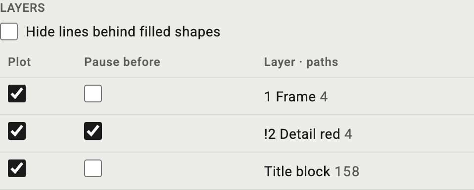

The dialog before a paused layer:

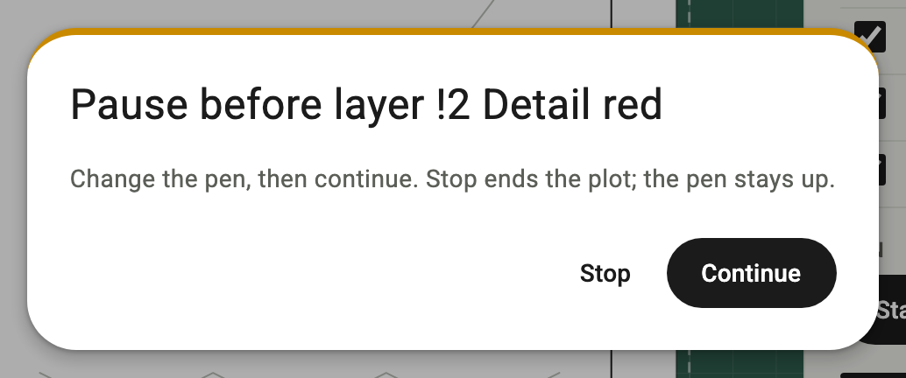

Hide lines behind filled shapes drops the parts of lines that lie behind a filled shape drawn later in the document, as if the shape covered them. The drawing is loaded again when the box is toggled.

Start plot starts. If paths leave the sheet or the machine travel, they are amber on the board, the step says how many, and Start plot asks before plotting anyway. Stop (or Esc) stops after the current line and raises the pen. ⌂ moves the head to the origin. Trace drawing frame moves around the drawing with the pen up.


The notice in the step and the question of Start plot when paths leave the sheet:


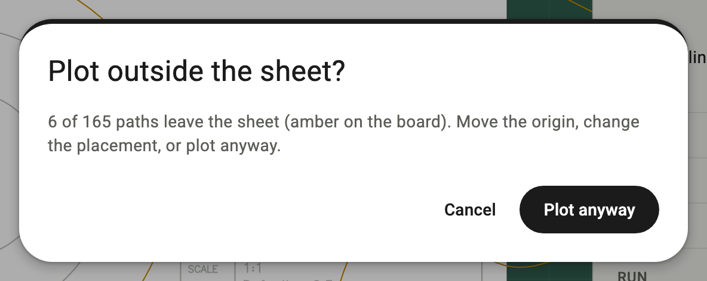

Next to the buttons, ≈ shows how long the plot will take: the drawn length at the drawing feed, the travel between the paths at the travel feed, and a pen down and up per path. Hover over it for the three parts. Acceleration and the time the plotter takes to answer each line are not in the formula, so on a real plotter the first estimate is probably too short; by how much is not measured yet and depends on the drawing. After the first finished plot of at least a minute, Plotter Studio knows the ratio of the measured to the estimated time for this model and multiplies every later estimate by it; the hover text shows the factor. Time spent in layer pauses does not count, plots in the simulator do not change the factor, and Reset keeps it.

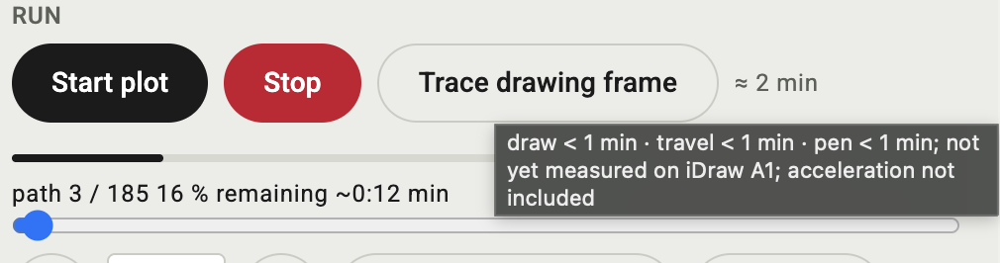

Once a plot has run, a bar under the buttons shows the path number, the share of the drawn length that is done, and the estimated time left. Travel moves are not counted, so both run a little ahead on drawings with many long jumps.

Below them you pick a path: drag the slider across the full width, click a path on the board (the pointer turns into a crosshair over a path; with a finger, within about 20 px of the line), type its number in the field and press Enter, or step with ‹ and ›. One click on an arrow moves one path; hold it and it runs on, about 20 paths a second. The picked path is drawn thick, the paths before it count as done. "Resume from N" next to the field plots from there to the end, for example after a stop or when the pen ran dry. "Plot this path" plots just that one path and leaves out the layer pauses, for example to redraw a line the pen skipped; the head stays at the end of the path instead of going back to the origin. ⌂ next to Stop sends it to the origin. After a stop the picker stands on the path where the plot stopped.

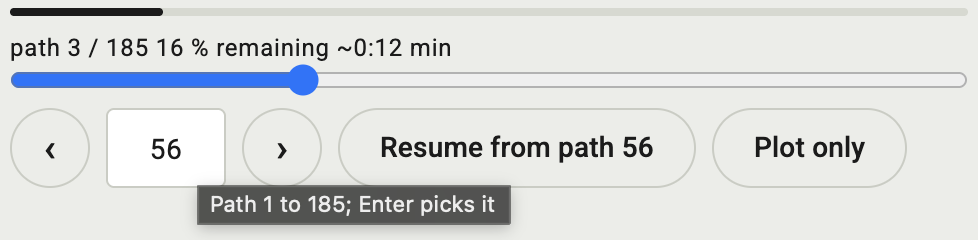


In the animation the stress test drawing runs in the simulator: plot, zoom in, stop, pick a path with the slider and the arrows, then Resume from N and Plot this path.

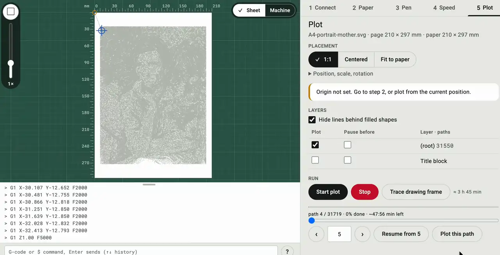

## Test drawings

The files in `extensions/tests/`, offered under Test drawing in step 4. A test drawing replaces your document until you pick your document again; placement, layers, the path picker and the plot work as with your own drawing. The four A4 landscape patterns come from code, `tests/make_test_svgs.py` writes them.

### A4-landscape-line-width.svg

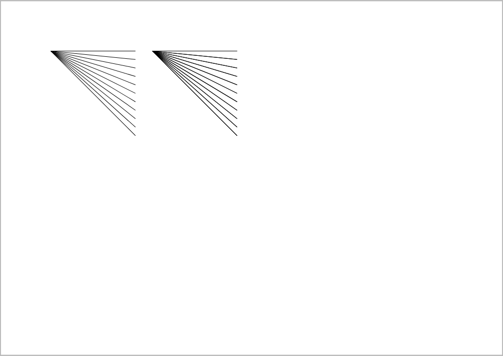

Measures how wide the pen really draws, after Piter Pasma. Eleven lines start in one point and fan out, so that the gap between neighbours grows by 1 mm for every 10 mm along the fan. The right fan draws every line twice, to compare a single with a double pass. Find where the lines stop touching, measure how far that is from the starting point in millimetres and divide by 10: that is the line width. Enter it as Line width in step 4; the board then draws the lines as wide as they come out, and the title block prints the value.

<br clear="all">

### A4-landscape-speed-rows.svg

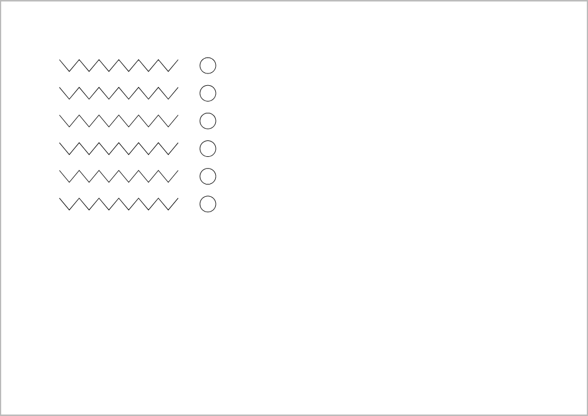

Six rows of zigzag with a circle next to each, meant to run at 1'000, 2'000, 3'000, 4'000, 6'000 and 8'000 mm/min, one speed per row, to see up to which speed corners and circles stay clean. An SVG cannot carry a feed rate per path, so from the list every row plots at the drawing feed of the profile. To compare speeds, plot it once per speed and change Drawing in step 4 in between.

<br clear="all">

### A4-landscape-accuracy.svg

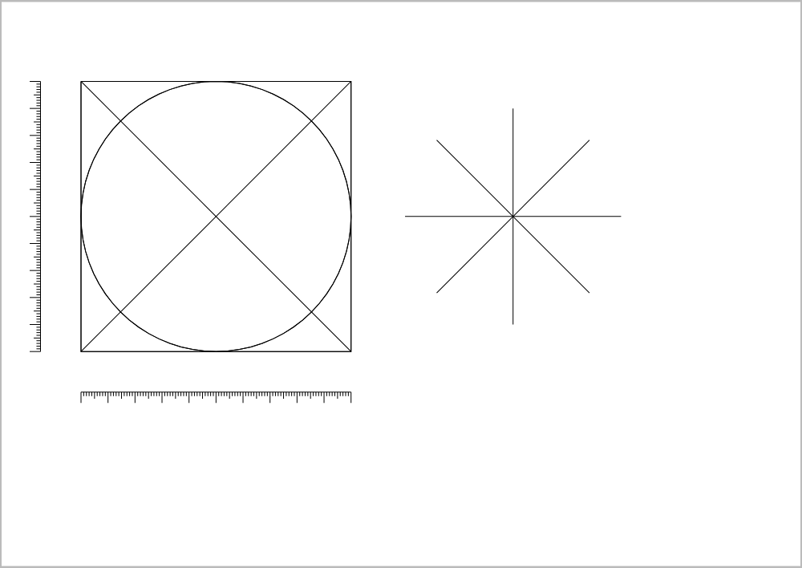

A 100 mm square with its diagonals and a circle, a star of eight lines and a millimetre ruler along each axis. Square and circle are drawn twice, once in each direction: if the two contours do not lie on top of each other, a belt has play. Star lines that miss the centre point to backlash when an axis changes direction. Measure the rulers with a steel rule: if 100 mm on the paper are not 100 mm, the scale of that axis is off.

<br clear="all">

### A4-landscape-pen-height.svg


Eight short lines, one under the other, meant to be drawn at pen heights from 3 to 6.5 mm in 0.5 mm steps, to find the height at which the pen draws a clean line without pressing too hard. An SVG cannot carry a pen height per path, so from the list every line plots at the Down height of the profile. To compare heights, use the ±0.5 buttons and Test stroke in step 3.

<br clear="all">

### A4-landscape-hidden-lines.svg

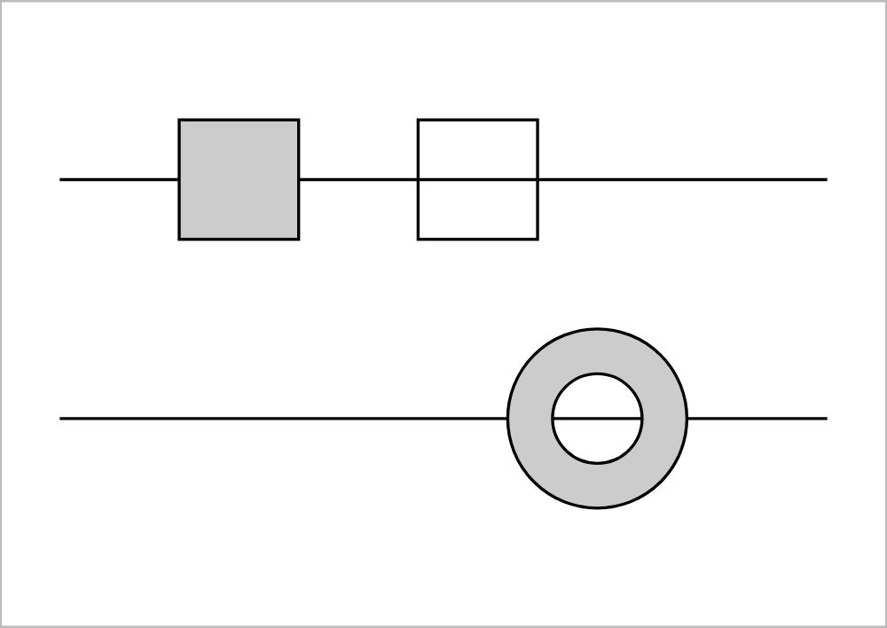

Two lines behind three shapes: a grey filled square, an empty square and a grey ring. With "Hide lines behind filled shapes" ticked in step 5, the upper line breaks off at the filled square and runs through the empty one, and the lower line breaks off in the grey band of the ring but shows in its hole. Untick the box and both lines run through everything. The fills themselves are not plotted, only the outlines.

<br clear="all">

### A3-landscape-line-width.svg

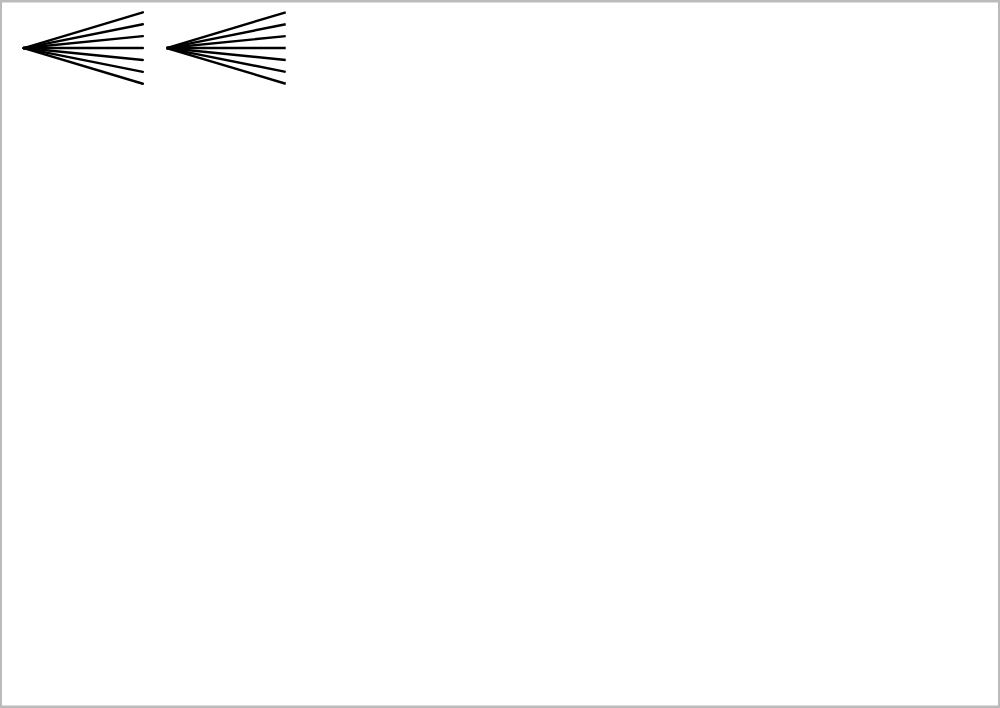

Piter Pasma's line test in its original form: two small fans of lines that meet in a point, in the top left corner of an A3 sheet. Where the lines run together shows how wide the pen draws. The A4 line width file above is built after it, larger and with a known spacing, so it is easier to measure.

<br clear="all">

### A3-portrait-iDraw-test-sheet.svg

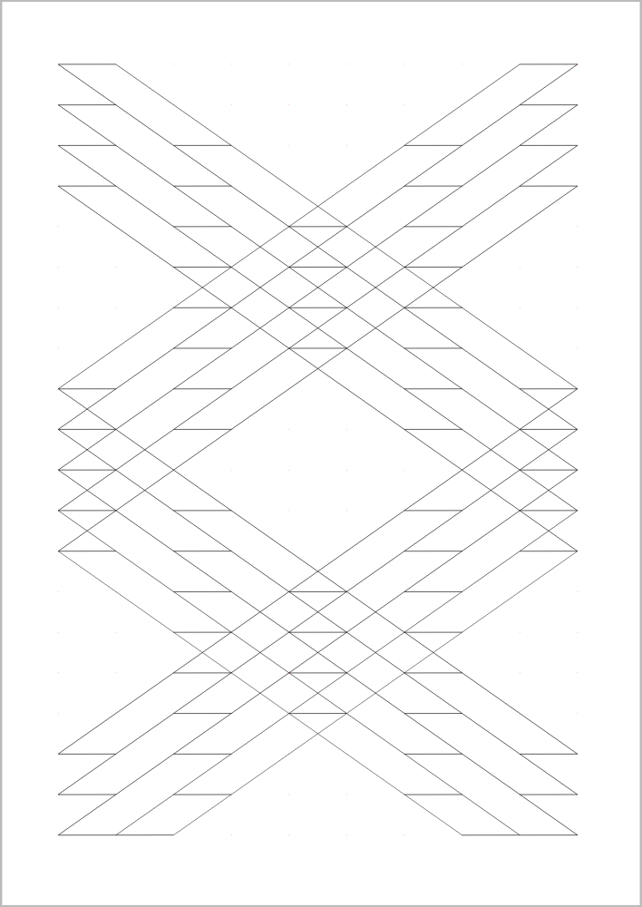

The A3 test sheet UUNA TEK ships with the iDraw, in three layers: a grid of dots, short lines and long diagonals across the whole sheet. A good first plot on a new machine, and the drawing in the README screenshot. The file has more layers that are hidden in Inkscape; Plotter Studio leaves them out, as it does with every hidden layer.

<br clear="all">

### A3-portrait-pen-calibration.svg

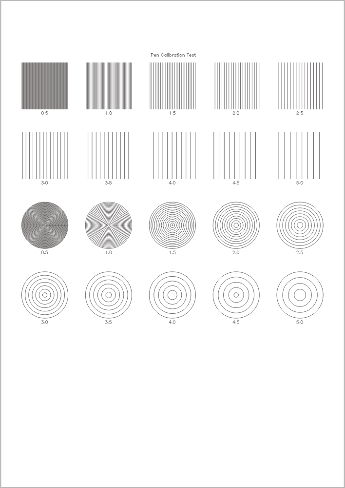

The pen calibration sheet from DrawingBotV3: ten fields of straight lines and ten of concentric circles, with 0.5 to 5.0 mm between the lines. Plot it with the pen you want to use and look for the field where the lines just stop running together. That spacing is the narrowest hatching the pen draws cleanly, a useful value for the hatch settings in DrawingBotV3 or another generator.

<br clear="all">

### A4-portrait-mother.svg

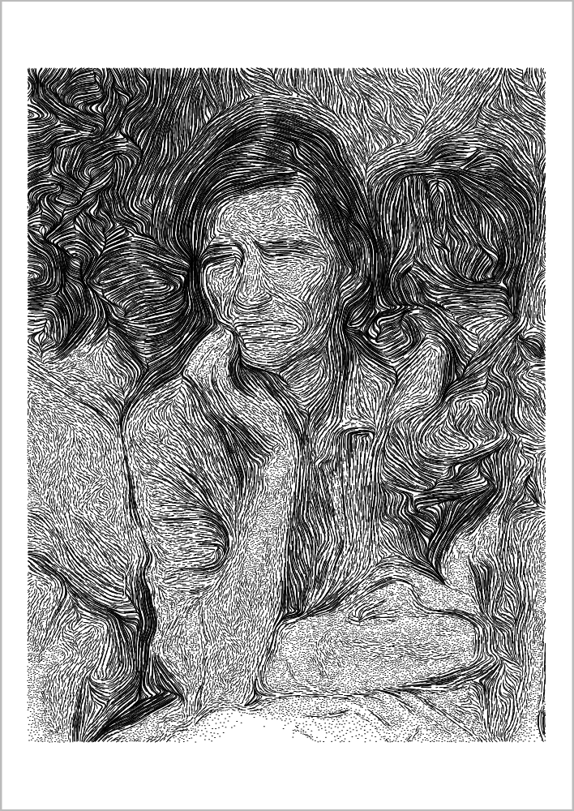

An engraving after Dorothea Lange's photograph Migrant Mother (1936), made by the author of Plotter Studio: 31'550 short paths on an A4 portrait sheet. It is the stress test: loading, the board and the path picker have to stay quick with it, which the e2e check large_drawing watches. With the default profile the estimate in step 5 is about 3 h 50 min. Set the paper to A4 portrait before plotting it.

<br clear="all">

## The board

Sheet fits the sheet into the view, Machine shows the whole travel range. The zoom slider on the left goes from 0.5× to 8×; drag on the board to pan, double-click to go back to the fitted view. The rulers follow the unit switch.

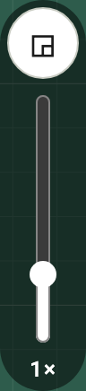 &nbsp; 

Plotted paths turn dark, travel moves are dotted. Moves made by hand (jog, console) leave a dashed trace; a plot clears it.

The title block (sheet, scale, pen, feed, file) is plotted in single-stroke text as the last layer, "Title block". The corner button on the board moves it through the four corners and off. It can also be unticked in the layer list.

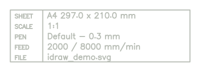

The line between board and log can be dragged to change their size; double-click resets it.


## Keyboard

Keys work when no input field has focus.

| Key | Action |
|---|---|
| Arrow keys | move the carriage by the current step |
| 1, 2, 3 | step size: 1, 10, 50 mm (0.1, 1, 5 cm; 0.05, 0.5, 2 in) |
| Space | pen up or down |
| Shift+Up, Shift+Down | current pen height 0.5 mm up or down, stored in the profile |
| Esc | stop |

## Console

The line under the log sends a G-code or `$` command as typed, for example `G1 X-20 Y-10 F3000` or `$H`. The reply appears in the log. Up and Down in the line go through the history. The ? button opens a command reference; a click on a command puts it into the line.

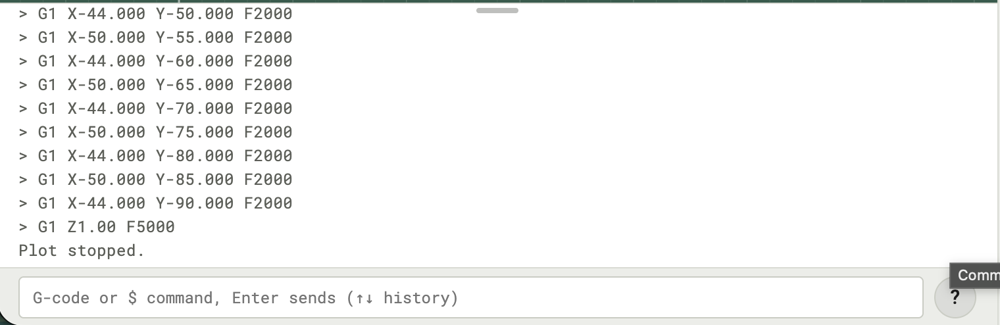

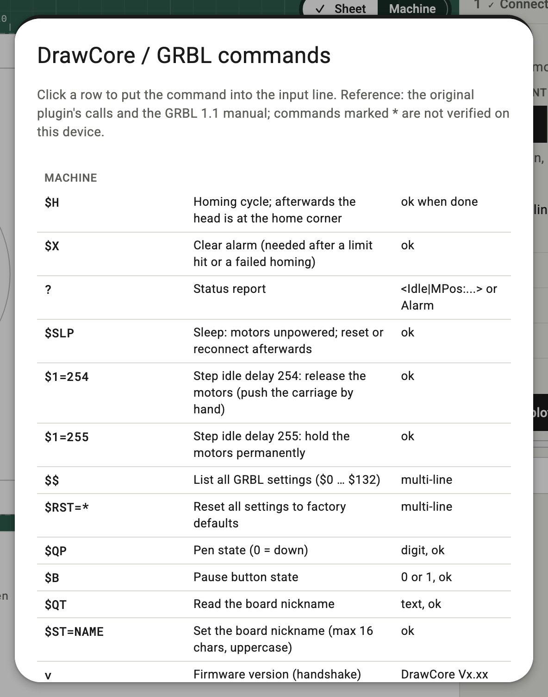

The software follows the typed commands (G0/G1, G90/G91, G92, `$H`, `$1`, `$SLP`, `$RST`), so position and pen stay right. Typed coordinates are machine coordinates. On the iDraw, G-code X is minus document Y and G-code Y is minus document X: `G1 X-20 Y-10` moves to document X 10, Y 20.

## Reset

A reload of the page, also in the middle of a plot, comes back to the same view: the step, zoom and pan of the board, Sheet or Machine, and whether Position, scale, rotation is open. The browser keeps this, so another browser or the iPad starts with its own view.

Reset in the app bar puts view, placement, layers and origin back to the defaults after a confirmation, and the page starts again at step 1. Paper format and orientation, saved pen profiles, the time factor and the connection stay.

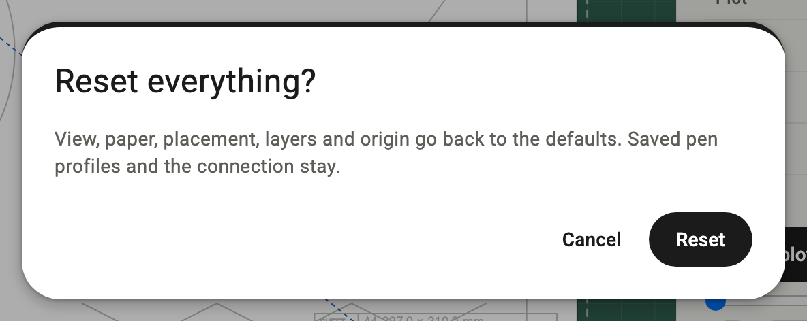

## Troubleshooting

The board does not answer. The software waits for the expected move time plus 15 s (homing: 120 s), then drops the connection. Check the cable and power, Connect again and Home.

The page shows an old drawing. Each run of the extension starts a server; if the old one is still running, the new one takes the next free port. Close the old browser tab and run the extension again.

Stop takes a moment. Stop waits until the plotter has finished the current line. Long straight lines in the drawing therefore stop later than short ones.
