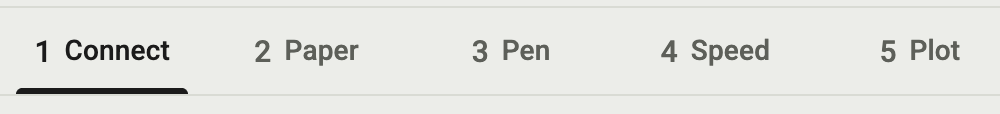
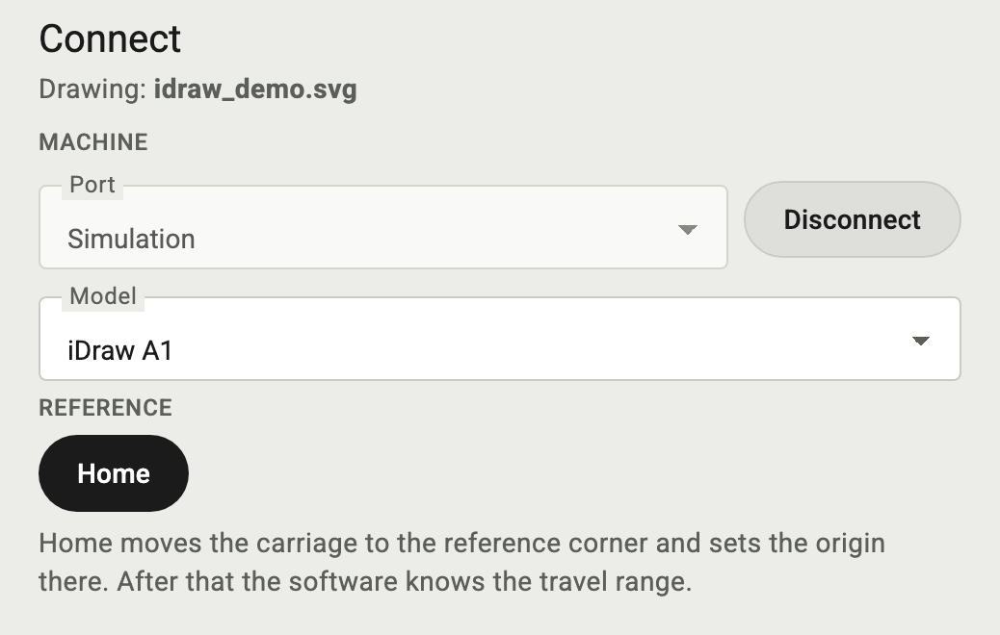
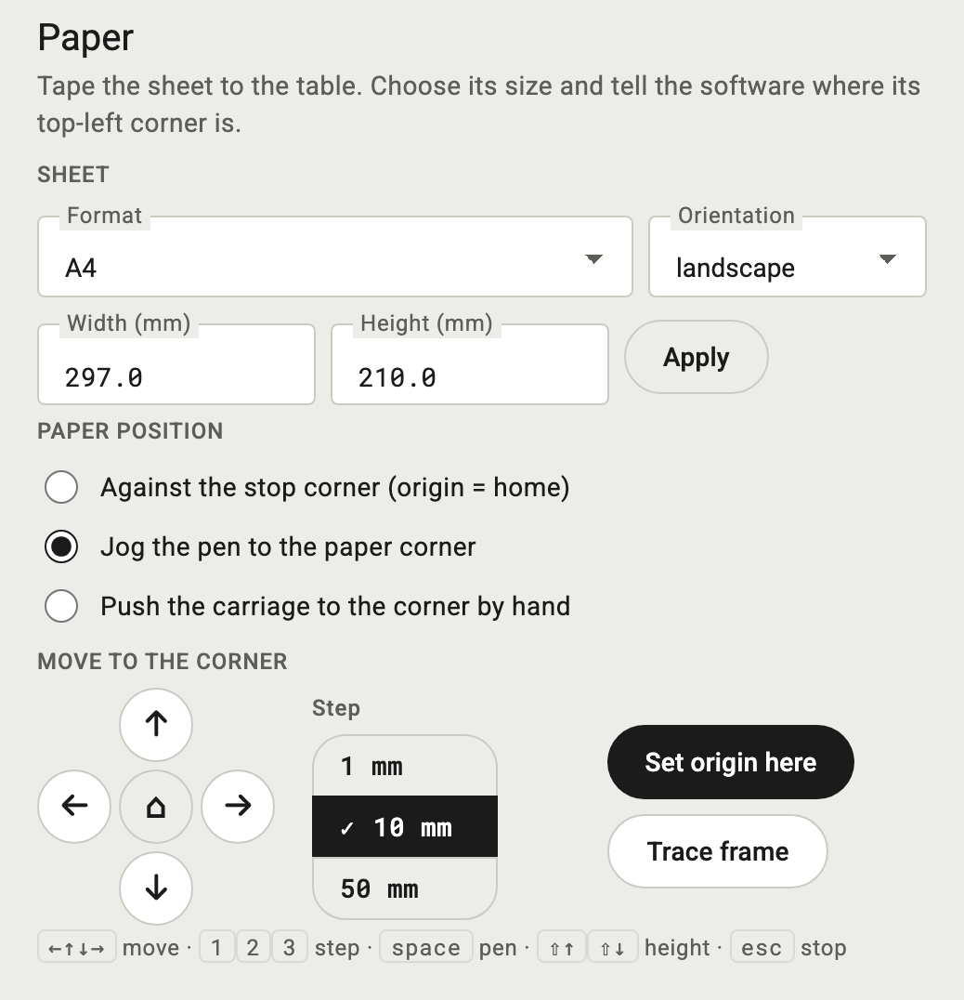
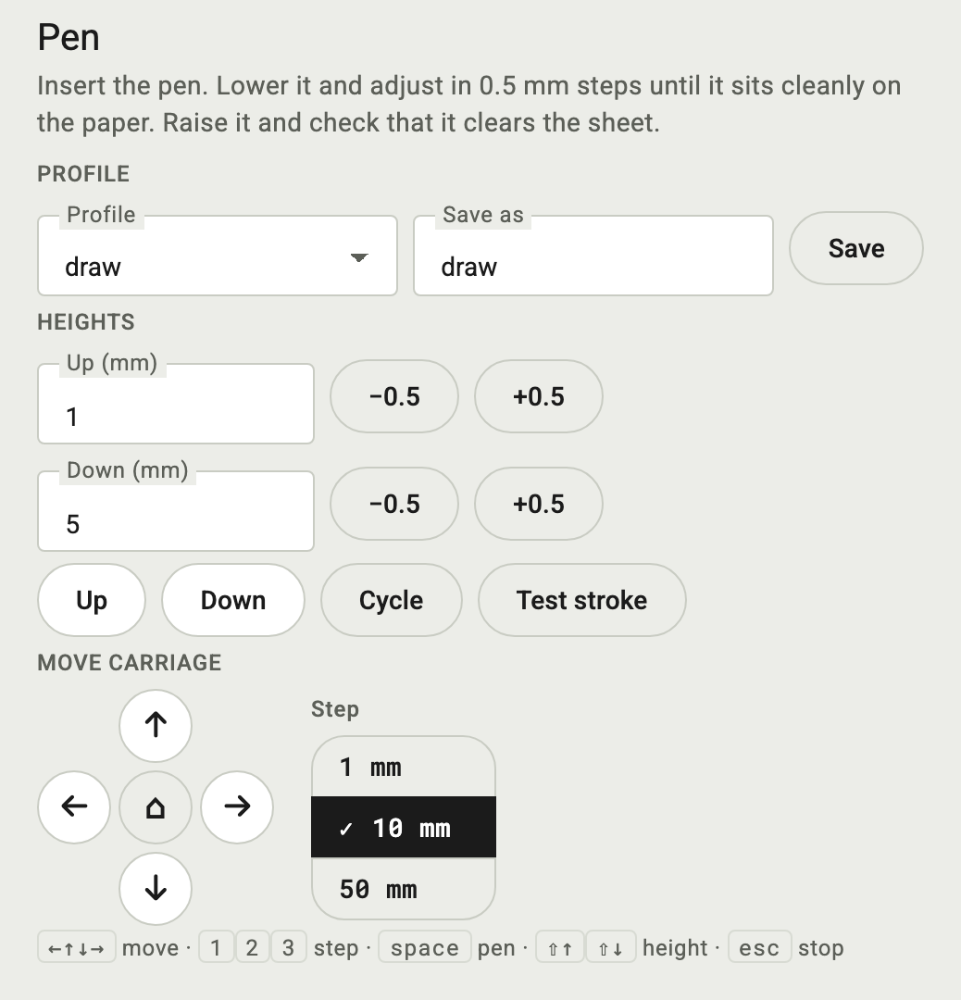
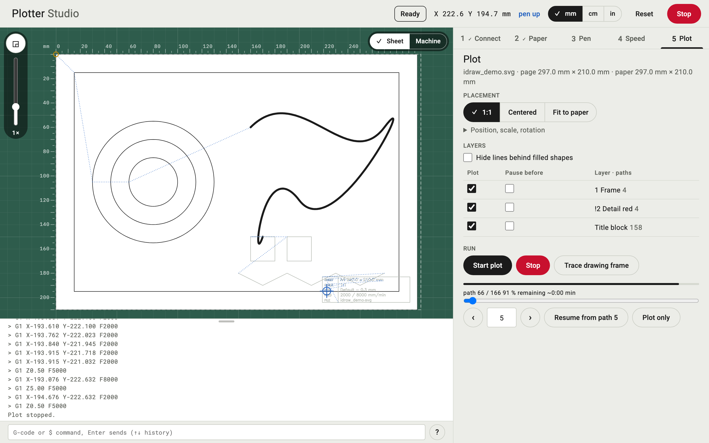

# Plotter Studio manual

How to use Plotter Studio, from the Inkscape menu to a finished plot. For the code, see [README.md](README.md).

Plotter Studio is an alpha. Only the simulator has been run so far. On a real plotter, start with small moves and keep a hand near the Stop button.

## Install

Copy the five files from `extensions/` into Inkscape's extension folder (on macOS `~/Library/Application Support/org.inkscape.Inkscape/config/inkscape/extensions/`):

```
idraw_core.py  idraw_server.py  idraw_web.html  idraw_interactive.py  idraw_interactive.inx
```

The original "iDraw 2.0 Control" by UUNA TEK has to be in the same folder, because Plotter Studio reads SVGs with its code from `idraw_deps/`. Restart Inkscape.

## Start

Open a document in Inkscape and choose Extensions > Plotter > Plotter Studio. The dialog has two options:

- Simulation: no device needed. The simulator answers like a plotter and runs four times faster than real time.
- Allow other devices on the network: the page can also be opened from an iPad or another computer in the same network. The address is printed by the server. Anyone on the network can then move the plotter; there is no password.

The extension returns at once and opens the page in the browser. Inkscape stays usable and the document is not changed. To plot a changed drawing, close the browser tab and run the extension again.

Without Inkscape, from a terminal in `extensions/`:

```
python3 idraw_server.py drawing.svg --sim
```

Further options: `--port N`, `--lan` (other devices), `--no-browser`.

## The page

The board on the left shows the sheet, the drawing and the carriage. Below it is the log with the console. On the right are the five steps, 1 Connect to 5 Plot. The tabs can be used in any order; a tick marks the steps that are done.

The app bar at the top shows the status (ready, moving, plotting, paused), the position, the pen state, the unit switch (mm, cm, in), Reset and a red Stop.

## The five steps



### Connect

Choose the port and click Connect. "Simulation" is always in the list. Choose your plotter in Model; the choice is remembered. Models other than the iDraw A1 are marked "(untested)": their commands were written from the vendors' code and have not run on a device yet.

Home moves the carriage to the reference corner and sets the origin there. After homing, the software knows the travel range of the machine and draws it on the board.



### Paper

Tape the sheet to the table. Choose the format and orientation, or "Custom" and type width and height, then Apply.

Then tell the software where the top-left corner of the sheet is. There are three ways:

- Against the stop corner: the sheet lies in the home corner, the origin is home.
- Jog the pen to the paper corner: move the carriage with the arrows until the pen is over the corner, then Set origin here.
- Push the carriage by hand: Release motors, push the pen tip onto the corner, Set origin here. The travel range is unknown afterwards and the machine frame is hidden.

Trace frame moves around the sheet with the pen up, so you can check the position.



### Pen

Insert the pen. Down lowers it, Up raises it; the heights are in mm and can be changed in 0.5 mm steps with the buttons next to them, or with Shift+Up and Shift+Down on the keyboard. Lower the pen until it sits cleanly on the paper, raise it and check that it clears the sheet.

Cycle lowers the pen, waits half a second and raises it. Test stroke draws a 30 mm line to the right of the current position and returns.

Heights, feed rates and line width form a profile. Type a name under "Save as" and click Save to keep it; choose it later in Profile.



### Speed

Feed rates for drawing and travel, in mm/min. Line width is the width you measured on paper; it is printed in the title block. Save profile stores the values in the current profile.

Test drawing replaces your document with a calibration sheet from the `tests/` folder: line widths, speed rows, accuracy, pen heights, hidden lines, the manufacturer's A3 test sheet and others. The first entry brings your document back. Plot it from step 5. Your own SVGs dropped into `tests/` appear in the list too.

### Plot

Placement puts the drawing on the sheet:

- 1:1: the page's top-left corner on the origin, no scaling.
- Centered: 1:1, page centered on the sheet.
- Fit to paper: scaled to the sheet with a 10 mm margin.

Position, scale, rotation (click to unfold) places the drawing freely. X and Y are the top-left corner of the drawing on the sheet, Scale is in percent and keeps the drawing's centre. The six align buttons put the drawing against the left, centre or right and the top, middle or bottom of the sheet; with Margin selected, they keep the distance set under Margin from the edges. ↺ and ↻ turn the drawing about its centre by the step chosen next to them, 90° (for example a portrait drawing onto a sheet taped in landscape) or 15°. The Angle field takes a number directly and rounds it to 15°. The presets fit the whole turned page, so Fit to paper makes a drawing at 45° smaller. The size of the drawing is shown next to the angle. While this part is unfolded, you can also drag the drawing on the board with the mouse; folded, a drag on the board moves the view as before. The three buttons above start again from 1:1, Centered or Fit to paper and keep the rotation.

Layers lists the layers of the document with their number of paths. Untick a layer to skip it. Tick "Pause before" to stop before a layer, for example to change the pen; a dialog asks to continue. Layer names in Inkscape set the defaults: a name starting with `!` pauses before the layer, a name starting with `%` is a note layer and is never plotted.

Hide lines behind filled shapes drops the parts of lines that lie behind a filled shape drawn later in the document, as if the shape covered them. The drawing is loaded again when the box is toggled.

Start plot starts. If paths leave the sheet or the machine travel, they are amber on the board, the step says how many, and Start plot asks before plotting anyway. Stop (or Esc) stops after the current line and raises the pen. Trace drawing frame moves around the drawing with the pen up.

Once a plot has run, a bar under the buttons shows the path number, the share of the drawn length that is done, and the estimated time left. Travel moves are not counted, so both run a little ahead on drawings with many long jumps.

Below them you pick a path: drag the slider across the full width, click a path on the board (the pointer turns into a crosshair over a path; with a finger, within about 20 px of the line), type its number in the field and press Enter, or step with ‹ and ›. One click on an arrow moves one path; hold it and it runs on, about 20 paths a second. The picked path is drawn thick, the paths before it count as done. "Resume from path N" next to the field plots from there to the end, for example after a stop or when the pen ran dry. "Plot only" plots just that one path and leaves out the layer pauses, for example to redraw a line the pen skipped. After a stop the picker stands on the path where the plot stopped.



## The board

Sheet fits the sheet into the view, Machine shows the whole travel range. The zoom slider on the left goes from 0.5× to 8×; drag on the board to pan, double-click to go back to the fitted view. The rulers follow the unit switch.

Plotted paths turn dark, travel moves are dotted. Moves made by hand (jog, console) leave a dashed trace; a plot clears it.

The title block (sheet, scale, pen, feed, file) is plotted in single-stroke text as the last layer, "Title block". The corner button on the board moves it through the four corners and off. It can also be unticked in the layer list.

The line between board and log can be dragged to change their size; double-click resets it.

## Keyboard

Keys work when no input field has focus.

| Key | Action |
|---|---|
| Arrow keys | move the carriage by the current step |
| 1, 2, 3 | step size: 1, 10, 50 mm (0.1, 1, 5 cm; 0.05, 0.5, 2 in) |
| Space | pen up or down |
| Shift+Up, Shift+Down | current pen height 0.5 mm up or down, stored in the profile |
| Esc | stop |

## Console

The line under the log sends a G-code or `$` command as typed, for example `G1 X-20 Y-10 F3000` or `$H`. The reply appears in the log. Up and Down in the line go through the history. The ? button opens a command reference; a click on a command puts it into the line.

The software follows the typed commands (G0/G1, G90/G91, G92, `$H`, `$1`, `$SLP`, `$RST`), so position and pen stay right. Typed coordinates are machine coordinates. On the iDraw, G-code X is minus document Y and G-code Y is minus document X: `G1 X-20 Y-10` moves to document X 10, Y 20.

## Reset

Reset in the app bar puts view, paper, placement, layers and origin back to the defaults after a confirmation. Saved pen profiles and the connection stay.

## Troubleshooting

The board does not answer. The software waits for the expected move time plus 15 s (homing: 120 s), then drops the connection. Check the cable and power, Connect again and Home.

The page shows an old drawing. Each run of the extension starts a server; if the old one is still running, the new one takes the next free port. Close the old browser tab and run the extension again.

Stop takes a moment. Stop waits until the plotter has finished the current line. Long straight lines in the drawing therefore stop later than short ones.
