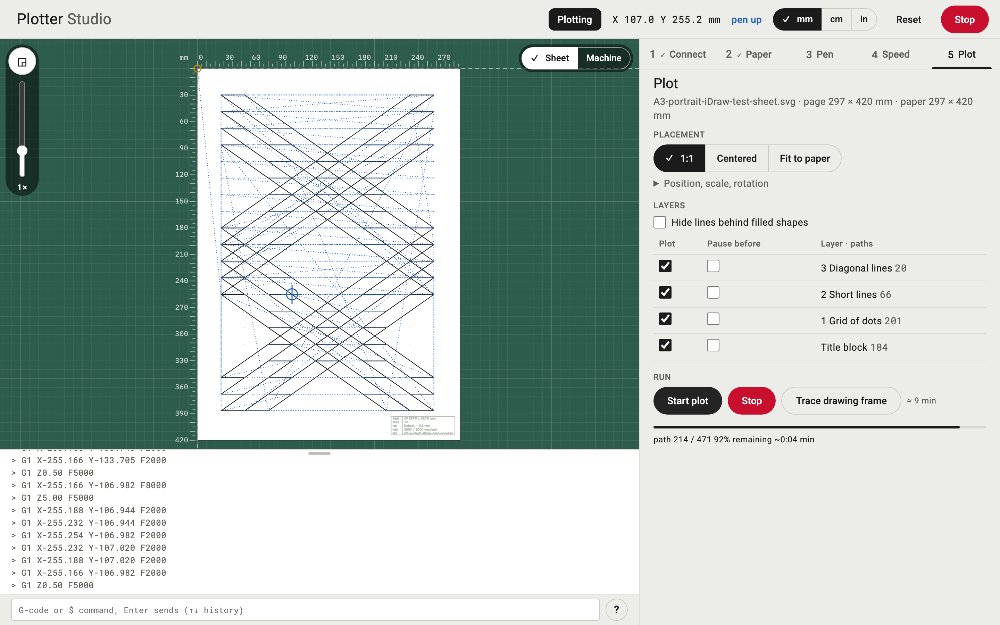

# Plotter Studio

Interactive pen plotter control as an Inkscape extension with a local web UI. Built for the UUNA TEK iDraw (DrawCore board, GRBL dialect); AxiDraw (EBB) and plain GRBL plotters are supported but untested. Wizard flow: Connect, Paper, Pen, Speed, Plot. Runs without a device in simulation mode, and on an iPad in the same network.

**Alpha.** This is an early version. Everything runs in the simulator, but nothing has been tested on a real plotter yet, so expect bugs and changes. Help is very welcome: test reports from an iDraw, AxiDraw or other GRBL plotter, bug reports and pull requests.

Have a pen plotter? You can help. Try Plotter Studio on your machine and tell us how it went in [issue #1](https://github.com/TLausZ/plotter-studio/issues/1); a short note like "homing went to the wrong corner" already helps. New features, other platforms and other plotters are welcome too. The rest of this README is written for people and agents who want to build on the code.



## Folders

```
plotter-studio/
  README.md                          this file
  DESIGN.md                          Material Design 3 components on the drafting palette; tokens and rationale of the web UI
  TESTING.md                         the three test levels, what each check verifies, how to add one
  TODO.md                            tasks and ideas
  iDraw Extension Analysis 2026-09-02.md   how the original plugin works, firmware commands, axis mapping
  docs/screenshot.png                web UI in the simulator, plotting the A3 test sheet (picture above)
  extensions/                        working copy; Inkscape reads ~/Library/Application Support/org.inkscape.Inkscape/config/inkscape/extensions
    idraw_core.py                    plotter logic without UI (transport, state, plot run, tests, SVG loading)
    idraw_server.py                  local HTTP server: one Session around a Plotter, JSON commands, server-sent events
    idraw_web.html                   the web UI, one file (HTML, CSS, JS), served by idraw_server.py
    idraw_interactive.py             Inkscape entry point: copies the document, starts the server detached, returns
    idraw_interactive.inx            menu entry Extensions > Plotter > Plotter Studio
    idraw_demo.svg                   example with three layers (normal, !-pause, %-notes)
    tests/                           test drawings, offered in the Speed step as a dropdown: the four built-in patterns as SVG
                                     (A4-landscape-line-width, -speed-rows, -accuracy, -pen-height; make_test_svgs.py writes them),
                                     A4-landscape-hidden-lines.svg (hidden-line removal), A3-landscape-line-width.svg (Piter Pasma's
                                     line test), A3-portrait-iDraw-test-sheet.svg (the manufacturer's A3 test sheet) and
                                     A3-portrait-pen-calibration.svg (DrawingBotV3 calibration sheet)
    HersheySans1.svg                 single-stroke font for the plotted title block (Hershey Fonts, see HersheySans1-LICENSE.txt)
    test_idraw_core.py               self-test for idraw_core
    test_idraw_server.py             self-test for the server (simulator, no browser)
    test_idraw_e2e.py                end-to-end test of the web UI with Playwright (simulator, headless Chromium)
    idraw_interactive_settings.json  created on first run: paper, profiles, model, unit (not in git)
    idraw_interactive_last.svg       copy of the document handed over by Inkscape (not in git)
    idraw2_0.inx, idraw2_0_control.py, idraw2_0_conf.py, idraw_plot_utils_import.py
                                     original "iDraw 2.0 Control" by UUNA TEK, unchanged, as fallback and reference
    idraw_deps/                      dependencies of the original; the new plugin uses its SVG digest
                                     (idraw2_0internal, ink_extensions, drawcore_plotink) and pyserial as a fallback
```

## Running

Demo without a device, from the terminal:

```
cd extensions
/usr/local/bin/python3 idraw_server.py idraw_demo.svg --sim
```

The server prints its address (default `http://127.0.0.1:8765/`) and opens the browser. Options: `--port N`, `--no-browser`, `--lan` to accept connections from other devices (the LAN address is printed; open it on the iPad). Any Python 3.8+ with lxml works; pyserial is optional, without it the pure-Python copy in `idraw_deps/serial` is used. Inkscape's own Python has both.

Tests: `python3 test_idraw_core.py`, `python3 test_idraw_server.py` and `python3 test_idraw_e2e.py` each print `ok`; what they cover and how to add a check is in [TESTING.md](TESTING.md).

In Inkscape: copy the five new files into Inkscape's extension folder (the originals are already there):

```
cp extensions/idraw_core.py extensions/idraw_server.py extensions/idraw_web.html \
   extensions/idraw_interactive.py extensions/idraw_interactive.inx \
   ~/Library/Application\ Support/org.inkscape.Inkscape/config/inkscape/extensions/
```

Restart Inkscape, open a document, Extensions > Plotter > Plotter Studio. The model defaults to iDraw A4; pick yours in step 1 (Connect), it is remembered. Tick "Simulation" for a dry run, "Allow other devices" for the iPad. The extension returns at once; Inkscape stays usable and the SVG is not modified. Run the extension again to load a changed drawing (it starts a second server on the next free port only if the first was closed; close the old browser tab first).

Keyboard on the page: arrow keys move the carriage, 1/2/3 set the step, Space toggles the pen, Shift+Up/Down shifts the current pen height by 0.5 mm and writes it into the profile, Esc stops. Keys are ignored while a field has focus. The input line under the log sends a hand-typed G-code or `$` command as is; the reply appears in the log (position is not tracked after hand-typed moves, run Home to resync). The unit switch (mm, cm, in) changes the readout, the paper fields, the jog steps and the rulers; everything is stored in mm. Paths that leave the sheet or the machine travel are amber on the board, the Plot step says how many, and Start plot asks before plotting anyway. The title block (sheet, scale, pen, feed, file) is plotted as a last layer "Title block" in single-stroke text; untick it in the Plot step or switch it off with the corner button on the board. Reset in the app bar puts view, paper, placement, layers and origin back to the defaults after a confirmation; saved pen profiles and the connection stay. After a stop (or a finished plot) the Run group shows a slider and "Resume from path N": drag it to the path to continue from, the board shows the paths still to plot, and the plot starts there; use it after a stop or when the pen ran dry. "Hide lines behind filled shapes" in the Plot step drops the parts of lines that lie behind shapes with a fill drawn later in the document (hidden-line removal, pure Python, no pyclipper needed); the drawing is loaded again when toggled. If the board stops answering, the transport gives up after the expected move time plus 15 s (homing: 120 s) and the connection is dropped; reconnect and home.

## Architecture

Three layers so the UI stays replaceable:

```
browser (idraw_web.html)  <-- HTTP/SSE -->  idraw_server.Session  -->  idraw_core.Plotter  -->  Transport (Serial, Sim)
```

`idraw_core.Plotter` holds the machine state (position in document mm, pen, status, profile) and produces G-code in exactly two places: `_move_abs` (XY, where the axis mapping X = −y, Y = −x lives) and `_z` (pen height). Commands run on its worker thread; it reports through a queue of events.

`idraw_server.Session` adds what a UI needs: the loaded SVG (page, layers), paper, placement, unit, profiles, and a fan-out of the plotter's events to every connected browser. The HTTP interface is three routes: `GET /api/snapshot` (everything), `GET /api/events` (server-sent events), `POST /api/cmd` (`{"cmd": name, ...}`). The command list is in the module docstring of `idraw_server.py`.

`idraw_web.html` keeps one snapshot object, re-renders the step panel from it, and draws the board as inline SVG in millimetre units, so the preview is exact by construction. The view fits the sheet by default; the Sheet/Machine toggle zooms out to the travel range, the zoom slider (0.5× to 8×) and drag-to-pan look closer.

### Building another UI

Any client that speaks the three routes works: a native app, a CLI, a different web page. Nothing in `idraw_core` or `idraw_server` knows about the HTML. For a very different interaction (for example a Tk window) use `idraw_core.Plotter` directly, as the archived Tk UI did (see `archive/tk-ui/` in commit 5256766).

### Other plotters

No model has been run on a device yet; the iDraw H A1 is the one to test first (see Status). Every other model is marked "(untested)" in the Model dropdown and the page says so when one is selected. `MODELS` in `idraw_core.py` lists the travel ranges, `dialect()` picks the command set from the model name: `drawcore` (iDraw: GRBL with the original's axis mapping and homing dance), `grbl` (any GRBL 1.1 pen plotter with Z as the pen and home switches, document axes sent as they are), `ebb` (AxiDraw EiBotBoard: `SM` moves in mixed motor steps, `SC`/`SP` for the servo, `EM` for the motors, no home switches, pen heights are servo percent 0-100). `SerialTransport.open()` accepts a DrawCore, an EBB or a plain GRBL banner. The AxiDraw and GRBL branches were written from the vendors' code, so verify axis directions and pen heights with small moves first.

### New features

Test drawings: drop an SVG into `extensions/tests/`, it appears in the Speed step dropdown. The generated patterns in `idraw_core.TESTS` are only used by `tests/make_test_svgs.py` (and `Plotter.run_test`, which no button calls any more). Placement modes: extend `place()` and the button row in step 5. Path sorting: apply `plot_optimizations.reorder` from `idraw_deps/idraw2_0internal` to the digest before `load_svg` builds the layers.

## Firmware, short version

DrawCore enumerates as CH340 (USB VID:PID 1A86:7523), 115200 baud, `rts`/`dtr` off. Send one line, wait for `ok`. `$H` homing, `$X` clear alarm, `$SLP` sleep, `$1=254`/`$1=255` motors released/held, `G92 X0 Y0` set origin, `G1 X Y F` move, `G1 Z F` pen, `$B` pause button, `$QP` pen state. Full table and sources in the analysis document.

## Status

As of 14 September 2026. Built and exercised in the simulator: all five steps, jog, pen, profiles, unit switch, test drawings, plot with layer pause, stop, resume from path N, progress, preview with rulers and title block, hidden-line removal, transport timeouts, LAN access. The e2e suite has 20 checks.

Not verified on the device yet:

- Homing sequence and the sign of the axis mapping (taken from the original).
- Whether the firmware knows realtime commands (`!` feed hold, `~` resume, `?` status during a move, `$J=` jog). Stop therefore takes effect after the current G-code line; a stroke is at most one segment long.
- Behaviour after `$SLP` (does the firmware need a reset?).
- `G92` after releasing the motors.

Security note: with `--lan` anyone on the network can move the plotter. There is no authentication; use it only on a trusted network.

Not built: copies, laser, multiple devices, webhook, path sorting, free positioning with the mouse on the board.

## License

GPL-3.0-or-later, see [LICENSE](LICENSE). The bundled original code in `extensions/idraw_deps/` keeps its own licenses: `idraw2_0internal` and `ink_extensions` (Evil Mad Scientist Laboratories, UUNA TEK) are GPL-2.0-or-later, `drawcore_plotink` and `serial` are MIT/BSD. The Hershey font has its own license in `extensions/HersheySans1-LICENSE.txt`.
